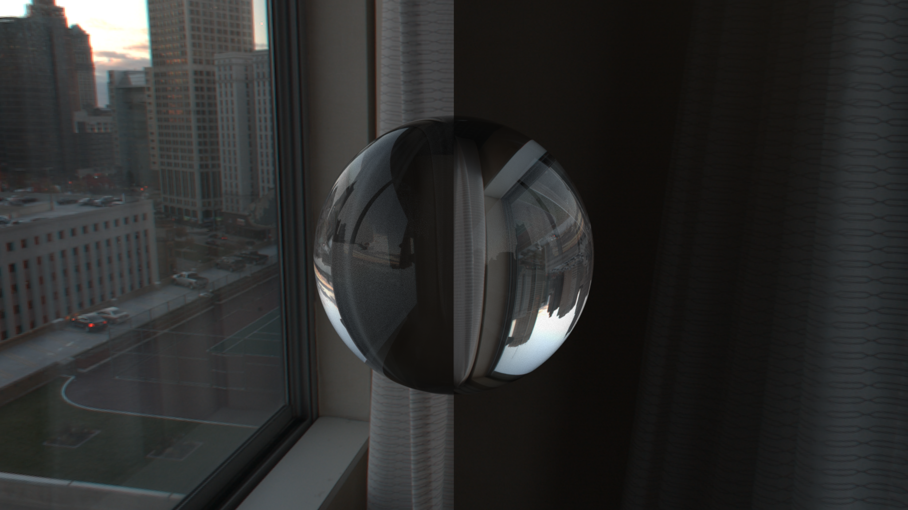

# OfflineRTLab
Render images with offline ray tracing(c++)

## Introduction
Part of the code reference from Peter Shirley’s [Ray Tracing mini-books](https://raytracing.github.io/), done in modern c++ for rendering images with offline ray tracing.

## Features
- Support loading obJ model
- Multithreaded rendering using Openmp
- Support rendering display progress bar
- Add some shape(cylinder, disk, cone, paraboloid, hyperboloid) from pbrt
- Support the HDRI map the sky boxes
- Bounding Volume Hierarchy with Surface Area Heuristic

## Result

scene's data refer to the project [Andromeda](https://github.com/moranzcw/Andromeda)

